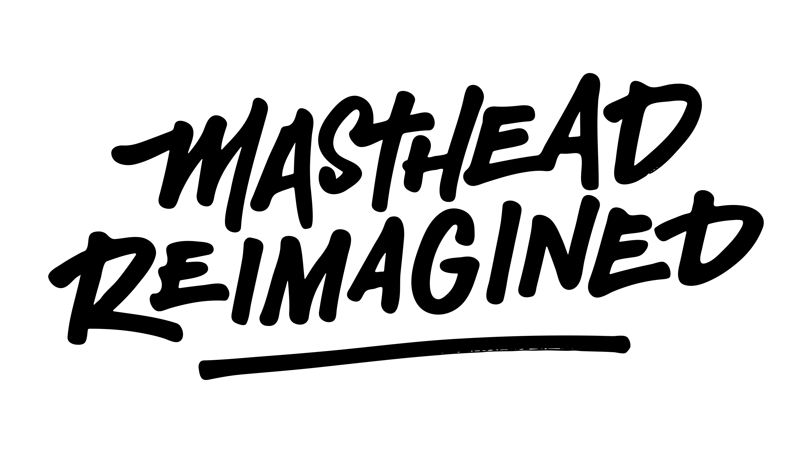

# News UX&D Styleguide Asset Library

Welcome to the NewsCorp Australia UX&D Styleguide asset repository. Here, we keep all of the master design assets that we use on a daily basis when designing for our Metro Mastheads.

## Pattern library

A Pattern Library is a centrally coded, living, visual and functional catalogue of design elements. These are the building blocks of responsive digital product experiences, across all devices. The project to create a Masthead Pattern Library is a work in progress, in the meantime we will maintain this Style Guide to reflect ‘the story so far’.

## Style Guide

The Style Guide will be a central online location for internal development and creative teams to access current brand/style guides pertaining to the Mastheads. In the future the contained elements will exist in the form of live components in the Pattern Library, however for now the UXD team with be curating the Style Guide to give guidance on brand and style usage.

## Benefit of the Pattern Library & Style Guide

* A more efficient implementation of modules and site components, naming convention and use of brand
* Build once deploy multiple times
* Suite of editorial tools
* Responsive to device or environment
* More reactive and quicker to market with new innovations
* Improve communication between teams and stakeholders
* A cleaner product set using consistent design patterns

## The UXD Team

The UXD team consist of a pool of multi-talented designers who are responsible for the following:

* Cutting edge and creative delivery of digital content
* Delivery of a solid user experience throughout our products
* Pushing the boundaries using emergent technologies and techniques
* Delivery of creative output akin to external creative agencies, with all of the advantages that come from having a central in-house, diverse and agile team.
* Please note that this is a work in progress and we’re constantly improving this as technology and culture change. If you feel like we’ve missed anything, or want to contribute, please contact one of us:

[Nigel Macquet](mailto:nigel.macquet@news.com.au) – Head of UXD

[Matt Webb](mailto:matthew.webb@news.com.au) – Design Director

[Rebecca Cornwall](mailto:rebecca.cornwall@news.com.au) – Design Director