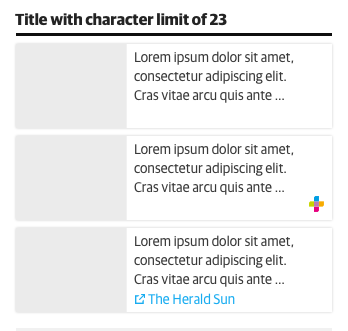
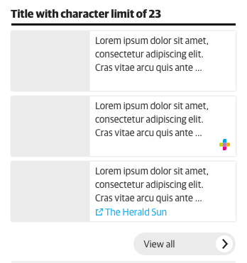
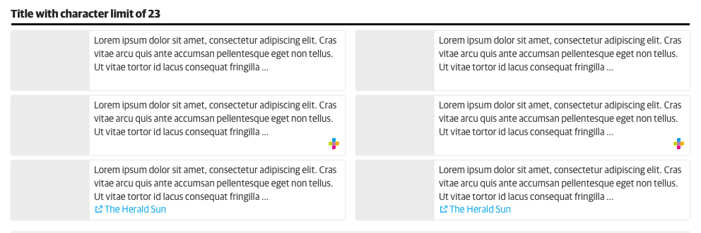
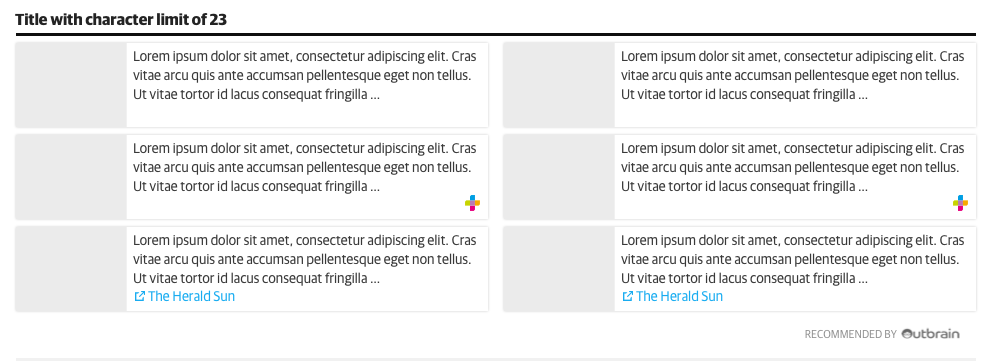

# Content List Module

The Content List components has two main formats being, one or two columns. The component is able to adjust to various screen sizes by declaring certain regions variable and certain regions fixed. The fixed regions help us accommodate image ratios. The components below show use the preferred 4:3 ratio however they have the flexibilty to accommodate a 16:9 ratio as well. 

### 1 Column List

### 2 Column List

### 2 Column List
