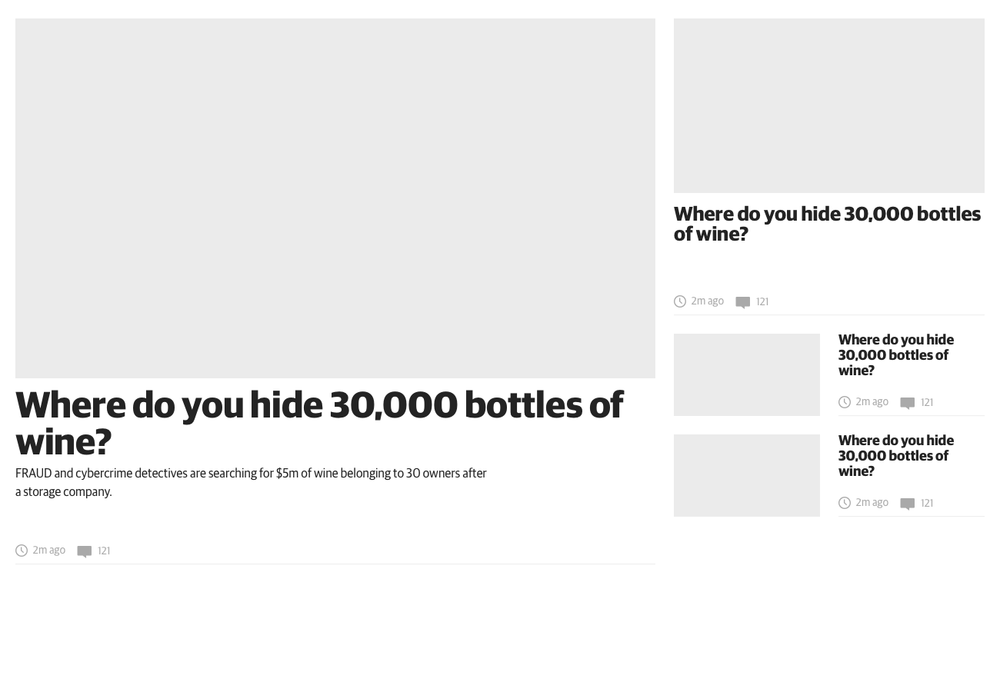
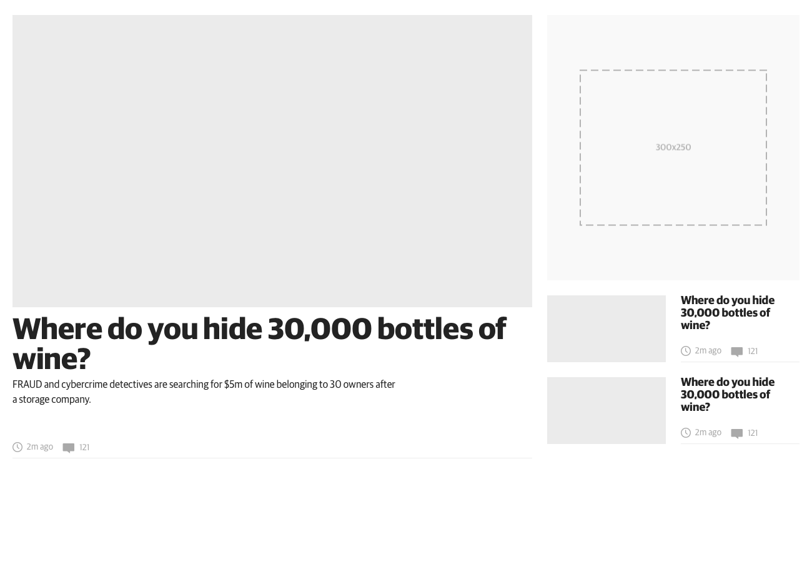
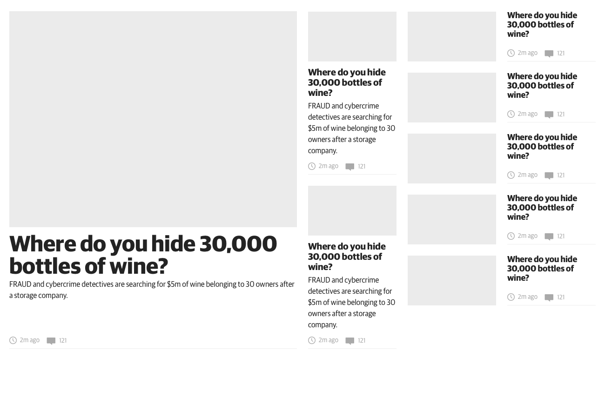
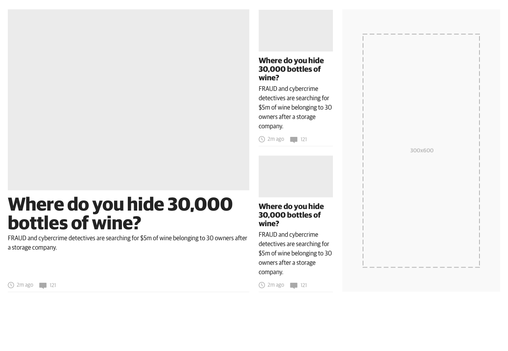
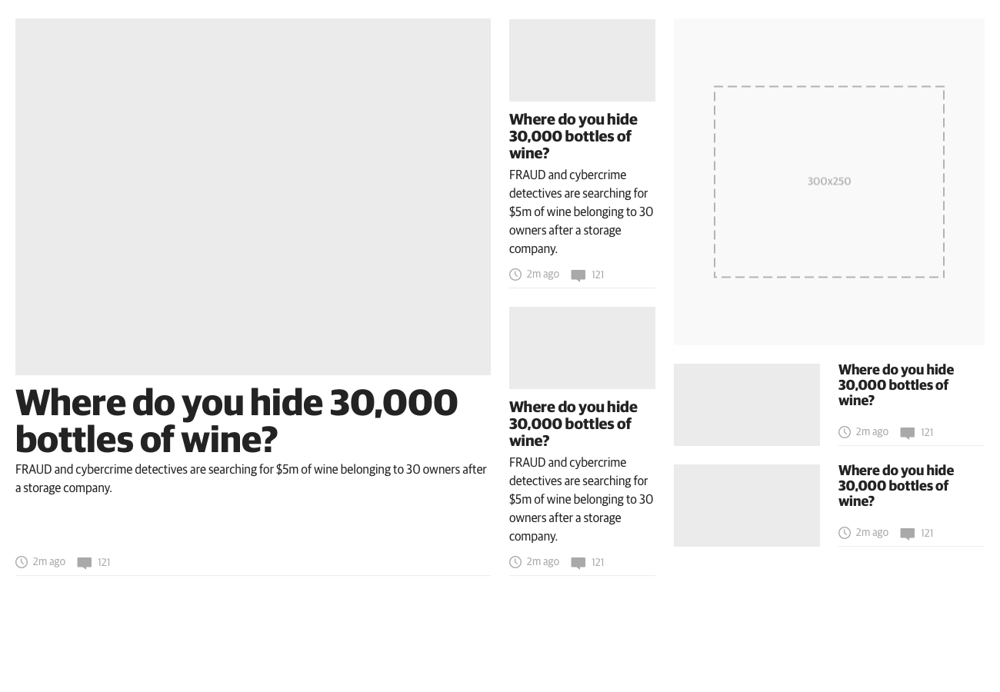
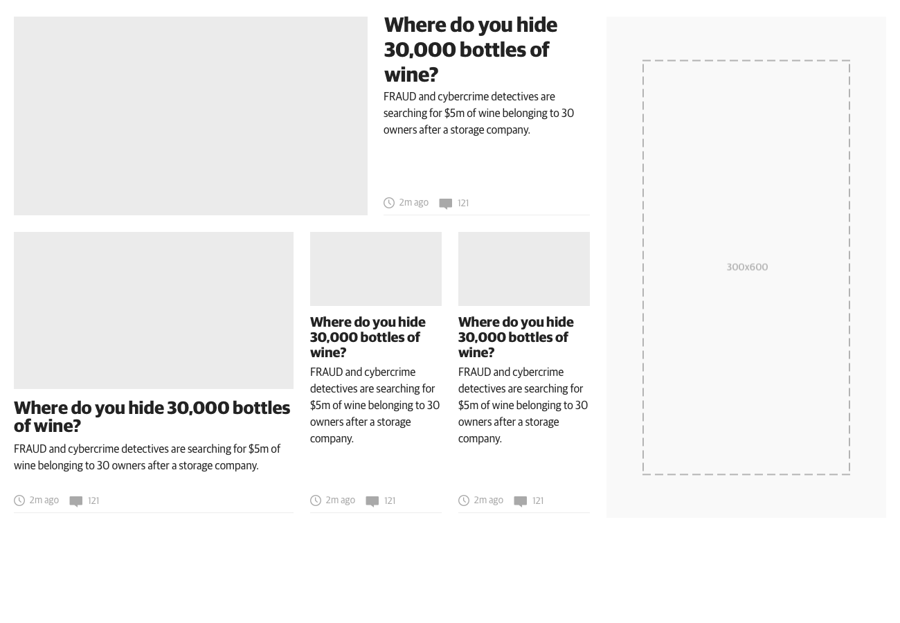
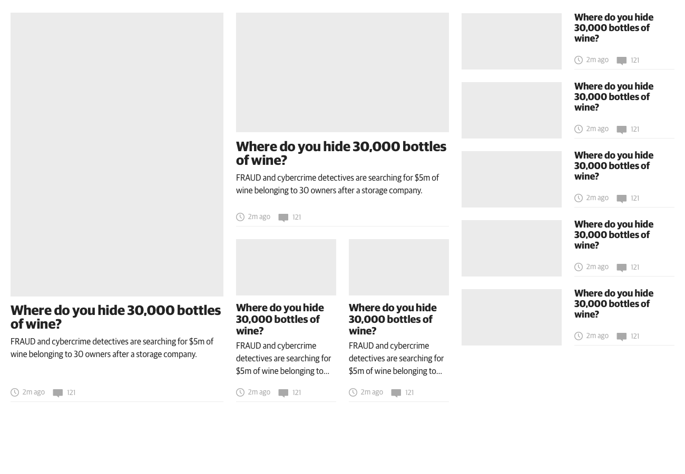
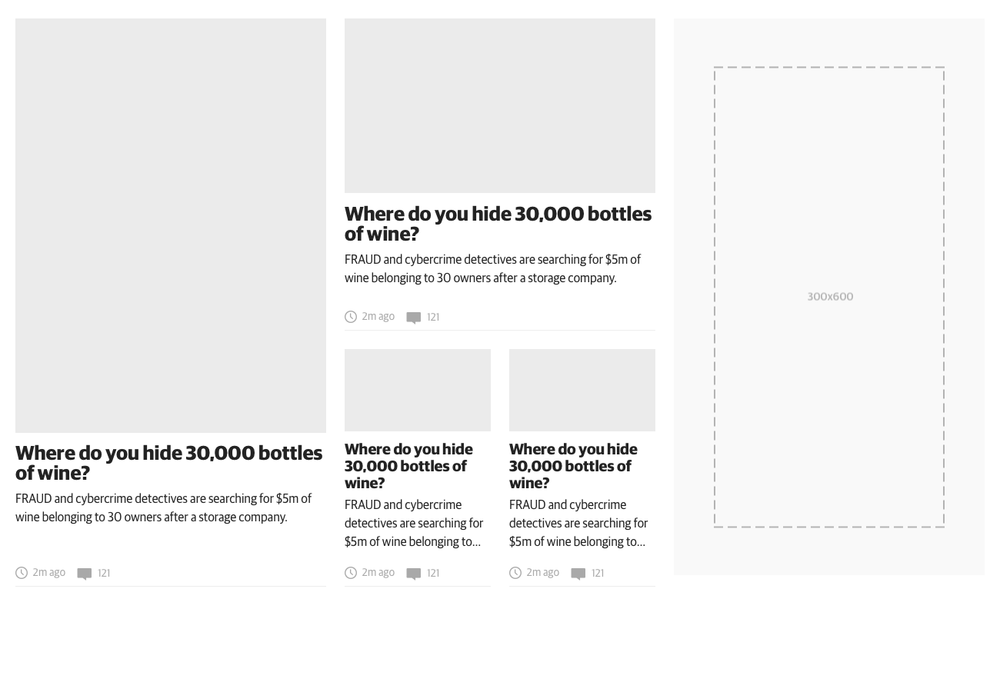
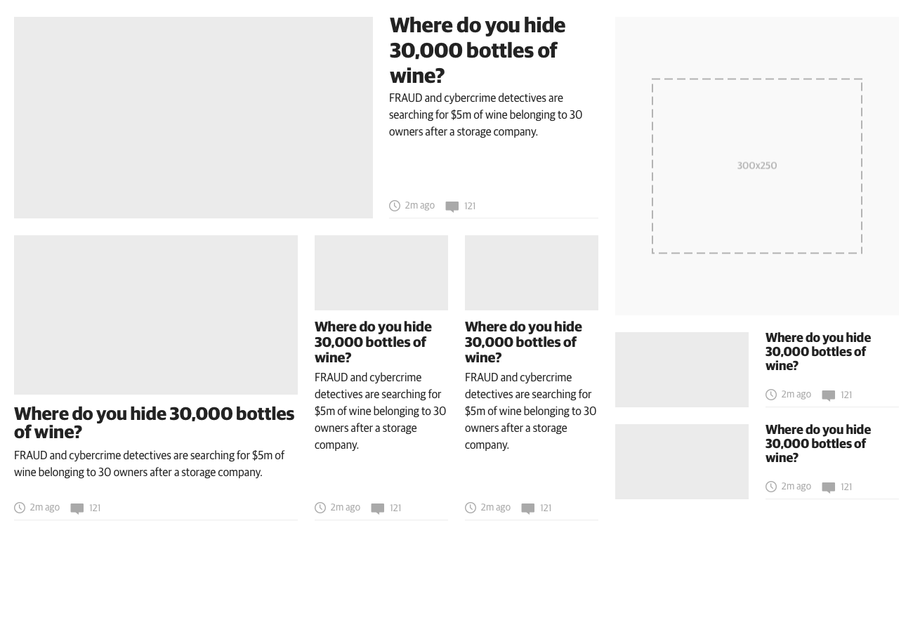

# Reimagine Mosaic Block System

This is the block system which underpins all of our article block layouts. It has been designed to provide a high level of flexibility when laying out a page, the core objective was to give editorial the ability to adjust the importance of a story not only inside a single block at any given time, but also throughout a news day. The blocks consist of three main area's, main, side and slim, with variable and configurable headings and the ability for widgets to be embedded between blocks.

### tgc-mosaic-full-1c-3c

### tgc-mosaic-full-1c-mrec2c

### tgc-mosaic-full-3c-5c

### tgc-mosaic-full-3c-hp

### tgc-mosaic-full-3c-mrec2c

### tgc-mosaic-full-4c-hp

### tgc-mosaic-full-4cp-5c

### tgc-mosaic-full-4cp-hp

### tgc-mosaic-full-4cp-mrec2c
