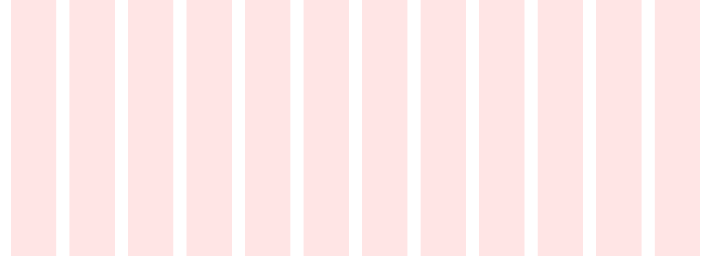

# Grids

####Desktop Extra Wide

1440 / 1360 - 40px Margin, 32px Gutters, 84px Column, 12 col

####Desktop Wide

1300 / 1260 - 20px Margin, 24px Gutters, 83px Column, 12 col

####Desktop Standard

1180 / 1140 - 20px Margin, 24px Gutters, 73px Column, 12 col

####Tablet Wide

960 / 920 - 20px Margin, 16px Gutters, 62px Column, 12 col

####Tablet Standard

768 / 728 - 20px Margin, 16px Gutters, 46px Column, 12 col

####Mobile

360 / 340 - 10px Margin, 8px Gutters, 21px Column, 12 col

